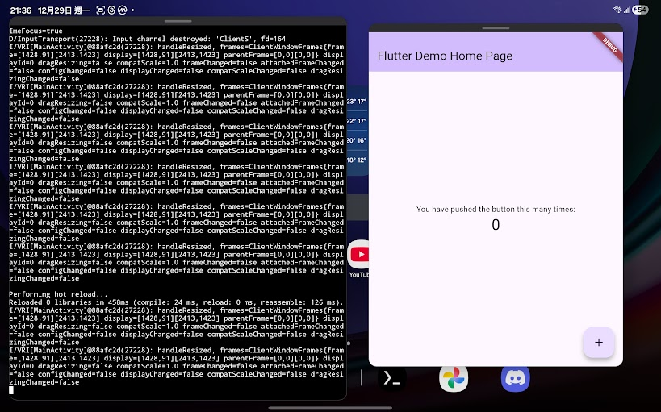

# Flutter Termux

Run the Flutter SDK on [Termux](https://termux.dev) (Android / Bionic ARM64).

This project cross-compiles the upstream Flutter SDK into a `.deb` package that
installs directly into a Termux `$PREFIX` and enables `flutter run`,
`flutter build apk`, and `flutter build linux` on-device.

## Version

| Component | Version |
|-----------|---------|
| Flutter   | 3.47.4 (stable) |
| Dart      | 3.13.3 |
| Architecture | aarch64 (ARM64) only |
| Package   | `flutter_3.47.4_aarch64.deb` |

Release asset: `flutter_3.47.4_aarch64.deb`

- Size: **617,009,288 bytes (~588 MiB)**
- SHA256: `6994580359002c6e0f6eb074d17a8ab3f9578e480e2aad83aa443474da3c9800`

Download:

```bash
curl -fSL -o flutter_3.47.4_aarch64.deb \
  https://github.com/GeneralKaos666/flutter-for-termux/releases/download/3.47.4/flutter_3.47.4_aarch64.deb
```

## Install

Requirements:

- AArch64 (ARM64) device running Termux. Only ARM64 is supported.
- Run `pkg up` first, and install `x11-repo`:

```bash
pkg update && pkg upgrade
pkg install x11-repo
```

### One-command install

```bash
curl -sL https://raw.githubusercontent.com/GeneralKaos666/flutter-for-termux/main/install_flutter_complete.sh \
  -o install_flutter_complete.sh
bash install_flutter_complete.sh
```

This installs the release package plus the on-device Android SDK/toolchain
(see [Install guide](docs/guides/INSTALL_GUIDE.md)).

### Manual install

```bash
curl -fSL -o flutter_3.47.4_aarch64.deb \
  https://github.com/GeneralKaos666/flutter-for-termux/releases/download/3.47.4/flutter_3.47.4_aarch64.deb

# verify integrity
sha256sum flutter_3.47.4_aarch64.deb
# expected: 6994580359002c6e0f6eb074d17a8ab3f9578e480e2aad83aa443474da3c9800

apt install ./flutter_3.47.4_aarch64.deb
bash $PREFIX/share/flutter/post_install.sh
```

`flutter` is installed to `$PREFIX/opt/flutter`. Verify with:

```bash
flutter doctor -v
```

### Uninstall

```bash
apt remove flutter
```

## Build an Android APK

Create your first project and build a debug APK:

```bash
flutter create my_app
cd my_app
flutter devices        # connect a device or emulator via adb
flutter build apk --debug --no-tree-shake-icons
```

### Per-project configuration

Script, run once per project:

```bash
bash $PREFIX/share/flutter/flutter_project_config.sh
```

or apply manually:

`android/gradle.properties`:

```properties
android.aapt2FromMavenOverride=/data/data/com.termux/files/usr/bin/aapt2
```

`android/app/build.gradle.kts`:

```kotlin
android {
    compileSdk = 34
    targetSdk = 34
    defaultConfig {
        ndk {
            abiFilters += listOf("arm64-v8a")
        }
    }
}
```

> Why compileSdk 34? Termux ships aapt2 2.19, which cannot load the
> `android.jar` for SDK 35/36. The engine is built against Android API 26 with
> weak imports, so targeting 34 keeps builds working on-device while remaining
> compatible. See [AAPT2 analysis](docs/guides/AAPT2_RELEASE_BUILD_BUG_ANALYSIS.md).

## Hot reload

Run on a connected device:

```bash
flutter devices
flutter run -d <device_id>
```

<p align="center">
  
</p>

## Linux desktop (Termux:X11)

Use [Termux:X11](https://github.com/termux/termux-x11/releases) to preview the
app:

```bash
export DISPLAY=:0
termux-x11 :0 >/dev/null 2>&1 &
flutter run -d linux
```

## Web server

```bash
flutter run -d web-server --web-port 8080
```

Then open `http://localhost:8080` in your browser.

## Build the package from source

Full pipeline on a Linux x86-64 host (WSL2 or a self-hosted runner), NDK r29,
`dpkg`, and `ar`:

```bash
python3 -m pip install -r requirements.txt
export ANDROID_NDK=/opt/android-ndk-r29

python3 build.py clone
python3 build.py sync
python3 build.py patch_engine
python3 build.py patch_dart
python3 build.py patch_skia
python3 build.py sysroot --arch=arm64
python3 build.py configure --arch=arm64 --mode=debug
python3 build.py build --arch=arm64 --mode=debug
python3 build.py debuild --arch=arm64
```

A full run takes roughly 2-4 hours on 24 threads. Patches are applied
explicitly (they are **not** part of the default `build.py` pipeline). See
[Build guide](docs/guides/BUILD_GUIDE.md) for details and troubleshooting.

## CI/CD

Releases are built and published through a manual evidence-tracked path
(`build-deb.yml`) and an ADB device smoke gate (`device-smoke.yml`); nightly
`autorelease.yml` detects new Flutter stable versions, bumps `build.toml`, and
rewrites version references.
See [CI/CD and device lab](docs/CI_CD.md).

## Documentation

- [Install guide](docs/guides/INSTALL_GUIDE.md) — on-device setup, prerequisites, troubleshooting.
- [Build guide](docs/guides/BUILD_GUIDE.md) — end-to-end source build and packaging.
- [Upgrade guide](docs/guides/UPGRADE_GUIDE.md) — moving to a new Flutter release.
- [Build process](docs/guides/BUILD_PROCESS.md) — historical build notes.
- [Changelog](docs/releases/CHANGELOG.md) — version history and notable fixes.
- [Release notes](docs/releases/RELEASE_NOTES.md) — GitHub release body.

## Limitations

- ARM64 only: `arm` and `x64` gen_snapshot builds fail (32-bit BoringSSL shift
  overflow / sysroot mismatch), so only the `aarch64` package is produced.
- The bundled build targets `debug` mode by default; release/profile require
  rebuilding those steps with `--mode=release`.